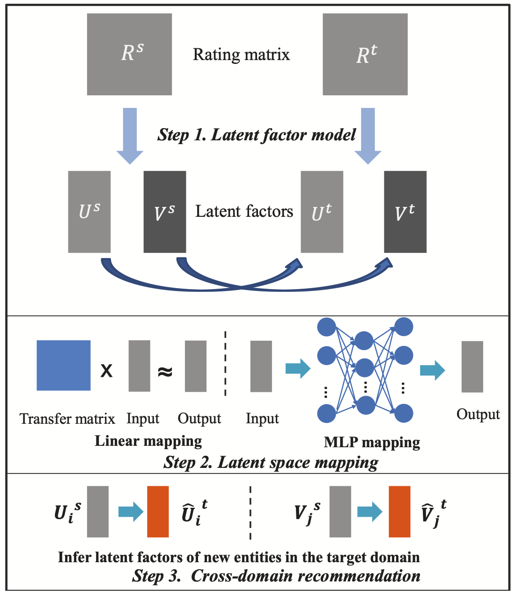

# EMCDR-MPC

This repository is based on the IJCAI 2017 paper [Cross-domain recommendation: An embedding and mapping approach](https://static.aminer.cn/upload/pdf/program/59ae3c262bbe271c4c71f007_0.pdf), where we made an initial attempt to guarantee the privacy of the user using Secure Multi-party Computation (MPC).

## Framework

balabalabala

## Fast demo

## Code

#### Installation

#### Training

#### Testing

#### Download

## Contact

If you have any questions, please email [Yuang Peng](https://github.com/ianpundar) at [yuangpeng.cn@gmail.com](mailto:yuangpeng.cn@gmail.com).
